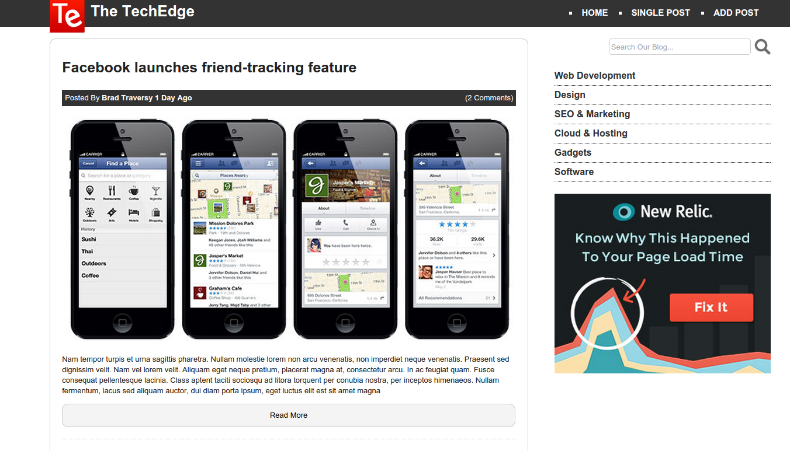
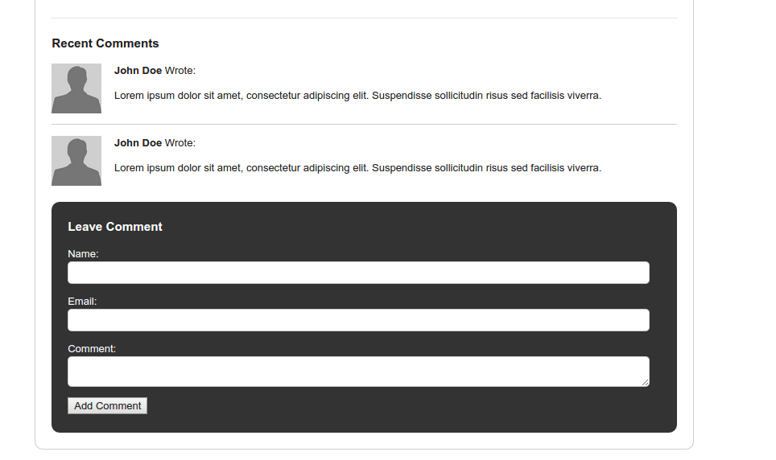
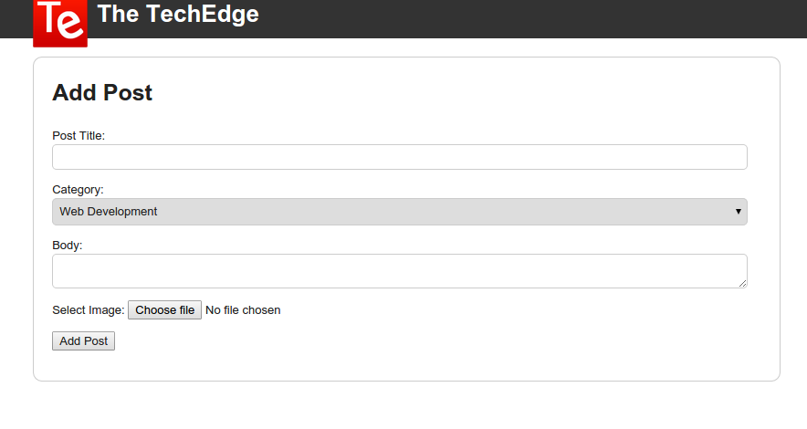

# blog-frontend
It's all about HTML5, no other technologies.

Bascally, I call it **The TechEdge**. A nice, simple template for a blog. We have the posted with metadata like when it was posted by whom and it shows the number of comments that each post has. and then we have the main image,  main text, and **Read More button** for every post. 

One the side, we have **search box** which obvously doesnt work and you need some severside codes for it to have the functionality. and a menu for the then list of categories which is styled nicely.

On the buttom, we have neat **footer** with copy right list of link to other pages.

If you click on the post, you can see the full **post page**, which on the bottom area we have comments with avatar, name if user, and then comment. We have comment form.

**Add post** have Post Title, Category, Nody, Choose file. but in order to meke it work, you should have a kind of server side codes.

The codes wrote from scratch using [HTML5 Boilerplate](https://html5boilerplate.com/)
